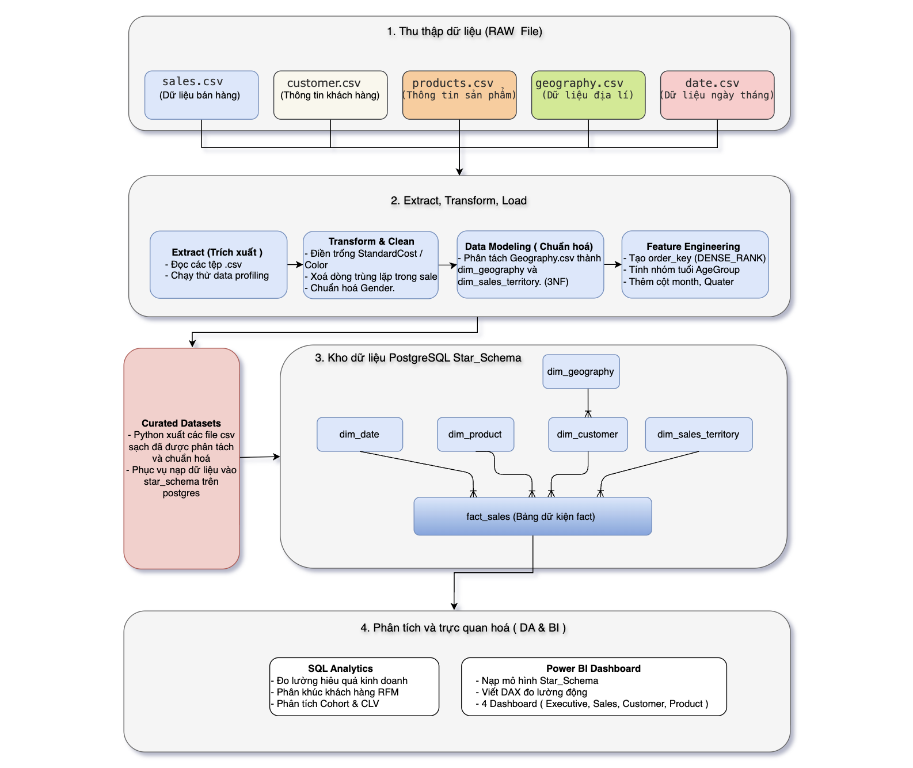

# Project: AdventureWorks Sales Data Warehouse & Business Intelligence


# 1. Project Overview

<p align="center">
    
</p>

### Mục tiêu

Xây dựng một hệ thống **Data Warehouse** hoàn chỉnh từ dữ liệu bán hàng **AdventureWorks** theo quy trình **ETL (Extract – Transform – Load)**. Sau khi làm sạch và biến đổi dữ liệu, xây dựng mô hình **Star Schema** trên **PostgreSQL**, sử dụng **SQL** để phân tích hiệu suất kinh doanh và trực quan hóa các kết quả bằng **Power BI**, từ đó hỗ trợ ra quyết định dựa trên dữ liệu.

Các nội dung chính của dự án bao gồm:

- Xây dựng quy trình ETL bằng Python (Pandas).
- Thiết kế và triển khai Star Schema trên PostgreSQL.
- Thực hiện các bài toán phân tích kinh doanh bằng SQL.
- Xây dựng dashboard trên Power BI để trực quan hóa các chỉ số quan trọng về doanh thu, lợi nhuận, khách hàng và sản phẩm.

###  **Tools & Technologies**

<div align="center">


  
  
  
  

</div>


---

# 2. ETL Pipeline

## 2.1 Extract Data

### Mục tiêu

Thu thập dữ liệu từ nhiều nguồn và đưa vào **Staging** để chuẩn bị cho quá trình xử lý.

### Nguồn dữ liệu

- customer.csv
- products.csv
- sales.csv
- geography.csv
- date.csv

### Công việc thực hiện

- Đọc dữ liệu bằng **Pandas**
- Thực hiện **Data Profiling**

### Data Profiling

Kiểm tra các thông tin:

- Số lượng bản ghi
- Số lượng thuộc tính
- Kiểu dữ liệu
- Giá trị NULL
- Giá trị trùng lặp
- Phân phối dữ liệu

Ví dụ:

```python
sales.info()

sales.describe()

sales.isnull().sum()

sales.duplicated().sum()
```

---

# 2.2 Transform Data

## Mục tiêu

Làm sạch, chuẩn hóa và biến đổi dữ liệu nhằm đảm bảo tính nhất quán và độ tin cậy trước khi xây dựng Data Warehouse.

---

## 2.2.1 Data Cleaning

### Xử lý dữ liệu thiếu (Missing Values)

#### Products

Một số sản phẩm như:

- HL Road Frame
- Mountain Frame
- Touring Frame

có thể thiếu:

- StandardCost
- Color

---

### Phương án 1: Điền giá trị 0

#### Khi nào sử dụng

- Giá vốn chưa được cập nhật.
- Muốn giữ sản phẩm trong hệ thống.
- Dữ liệu thiếu chiếm tỷ lệ rất nhỏ.
- Chỉ phục vụ thống kê doanh thu hoặc số lượng.

#### Thực hiện

```python
product['StandardCost'] = product['StandardCost'].fillna(0)
```

#### Ưu điểm

- Đơn giản.
- Không làm mất dữ liệu.
- Không ảnh hưởng số lượng bản ghi.

#### Nhược điểm (Trade-off)

Lợi nhuận sẽ bị tính cao hơn thực tế:

```text
Profit = SalesAmount - 0
```

---

### Phương án 2: Điền bằng giá vốn trung bình của SubCategory

#### Khi nào sử dụng

- Các sản phẩm trong cùng SubCategory có mức giá vốn tương đối giống nhau.
- Muốn giữ đầy đủ dữ liệu nhưng vẫn đảm bảo tính hợp lý khi phân tích.

#### Thực hiện

```python
product['StandardCost'] = (
    product.groupby('SubCategory')['StandardCost']
           .transform(lambda x: x.fillna(x.mean()))
)
```

#### Ưu điểm

- Giữ nguyên số lượng dữ liệu.
- Giá vốn hợp lý hơn.
- Phân tích lợi nhuận sát thực tế hơn.

#### Nhược điểm (Trade-off)

- Chỉ là giá trị ước lượng.
- Không phản ánh tốt nếu sự chênh lệch giá trong cùng SubCategory quá lớn.

---

### Phương án 3: Xóa bản ghi

#### Khi nào sử dụng

- Dữ liệu thiếu rất ít (<5%).
- Không có cơ sở hợp lý để ước lượng.
- Phân tích yêu cầu độ chính xác cao.

#### Thực hiện

```python
product = product.dropna(subset=['StandardCost'])
```

#### Ưu điểm

- Không đưa dữ liệu giả định vào hệ thống.
- Đảm bảo các phép tính dựa trên dữ liệu thực.

#### Nhược điểm (Trade-off)

- Làm giảm số lượng dữ liệu.
- Có thể gây Selection Bias nếu dữ liệu thiếu không ngẫu nhiên.

---

### Xử lý dữ liệu trùng lặp

```python
sales.drop_duplicates(inplace=True)
```

---

### Chuẩn hóa dữ liệu chuỗi

Thực hiện:

- Loại bỏ khoảng trắng thừa.
- Đồng nhất chữ hoa/chữ thường.

Ví dụ:

```python
customer['Gender'] = customer['Gender'].str.upper()
```

---

## 2.2.2 Data Modeling

### Chuẩn hóa bảng Geography

#### Mục đích

Chuẩn hóa dữ liệu địa lý bằng cách tách bảng **geography.csv** thành hai bảng Dimension nhằm giảm trùng lặp dữ liệu và phù hợp với mô hình **Star Schema**.

#### Cách thực hiện

**dim_geography**

- GeographyKey
- City
- PostalCode
- CountryName
- SalesTerritoryKey

**dim_sales_territory**

- SalesTerritoryKey
- SalesTerritoryRegion
- SalesTerritoryGroup

#### Ý nghĩa

- Giảm trùng lặp dữ liệu.
- Chuẩn hóa dữ liệu theo nguyên tắc 3NF.
- Tăng khả năng tái sử dụng thông tin vùng bán hàng trong các phân tích.

---

## 2.2.3 Feature Engineering

### Tạo `order_key`

#### Mục đích

Grain của bảng **fact_sales** nằm ở mức **Product Line**, nghĩa là mỗi dòng biểu diễn một sản phẩm trong một đơn hàng.

Do bộ dữ liệu không cung cấp mã đơn hàng riêng nên tạo thêm **order_key** dựa trên:

```text
(customer_key, order_date)
```

#### Business Logic

1. Lấy các cặp `(customer_key, order_date)`.
2. Sắp xếp theo `customer_key` và `order_date`.
3. Gán `order_key` tuần tự bằng `DENSE_RANK()`.
4. Merge `order_key` trở lại bảng `fact_sales`.

#### Ý nghĩa

Việc tạo `order_key` giúp thực hiện các phân tích:

- Number of Orders
- Average Order Value (AOV)
- Purchase Frequency
- Cohort Analysis
- Customer Lifetime Value (CLV)

---

## 2.2.4 Export Curated Dataset

### Mục tiêu

Sau khi hoàn thành quá trình làm sạch và biến đổi dữ liệu, các bảng được xuất thành các file CSV mới để tạo thành **Curated Dataset**.

Đây sẽ là nguồn dữ liệu đầu vào cho quá trình xây dựng Data Warehouse.

### Lợi ích

- Tách biệt dữ liệu gốc (Raw Data) và dữ liệu đã xử lý (Curated Data).
- Dễ dàng kiểm tra kết quả ETL trước khi Load.
- Hỗ trợ tái sử dụng cho nhiều hệ quản trị cơ sở dữ liệu.
- Giúp quy trình ETL dễ bảo trì và mở rộng.

---

# 3. Load Data Warehouse

### Mục tiêu
- Sau khi dữ liệu đã được làm sạch và chuẩn hóa, tiến hành nạp (Load) dữ liệu vào PostgreSQL và xây dựng **Data Warehouse** theo mô hình **Star Schema** nhằm tối ưu cho việc truy vấn, tổng hợp và trực quan hóa dữ liệu trên Power BI.

## 3.1 Thiết kế Star Schema

Mô hình bao gồm một bảng Fact ở trung tâm và các bảng Dimension xung quanh.

### Fact Table

### Fact_Sales

Bảng Fact lưu trữ các chỉ số (Measures) của hoạt động bán hàng.

**Measures**

| Column | Mô tả |
| --- | --- |
| order_quantity | Số lượng sản phẩm bán |
| product_standard_cost | Giá vốn của sản phẩm tại thời điểm bán |
| sales_amount | Doanh thu bán hàng |

**Foreign Keys**

| Column | Tham chiếu |
| --- | --- |
| product_key | Dim_Product |
| customer_key | Dim_Customer |
| sales_territory_key | Dim_Sales_Territory |
| order_date_key | Dim_Date |

> **Lưu ý:** Các chỉ số như **Profit**, **Profit Margin**, **Average Selling Price** sẽ **không nên lưu trong Fact Table** mà được tính động bằng DAX trong Power BI nhằm giảm dư thừa dữ liệu và đảm bảo tính nhất quán khi nghiệp vụ thay đổi.
>
---
### Dimension Tables
### Dim_Customer

Lưu trữ thông tin mô tả của khách hàng phục vụ phân tích theo giới tính, tình trạng hôn nhân và khu vực địa lý.

| Thuộc tính | Kiểu dữ liệu | Mô tả |
| --- | --- | --- |
| customer_key | INT | Khóa chính của bảng khách hàng. |
| customer_name | VARCHAR(50) | Họ và tên đầy đủ của khách hàng. |
| birth_date | DATE | Ngày sinh của khách hàng. |
| gender | VARCHAR(50) | Giới tính của khách hàng (Male/Female). |
| marital_status | VARCHAR(50) | Tình trạng hôn nhân của khách hàng (Single/Married). |
| geography_key | INT | Khóa ngoại tham chiếu đến bảng **dim_geography**, xác định vị trí địa lý của khách hàng. |

> **Feature Engineering**
> 
> 
> Bổ sung thuộc tính **AgeGroup** được suy diễn từ `BirthDate` nhằm hỗ trợ phân tích phân khúc khách hàng theo độ tuổi.
> 
> | Thuộc tính | Kiểu dữ liệu | Mô tả |
> | --- | --- | --- |
> | age_group | VARCHAR(20) | Nhóm tuổi của khách hàng (Youth, Adult, Middle Age, Senior). |
### Dim_Product

Lưu trữ thông tin sản phẩm.
| Thuộc tính    | Kiểu dữ liệu  | Mô tả                         |
| ------------- | ------------- | ----------------------------- |
| product_key   | INT           | Khóa chính của bảng sản phẩm. |
| product_name  | VARCHAR(50)  | Tên sản phẩm.                 |
| category      | VARCHAR(50)   | Danh mục sản phẩm.            |
| sub_category  | VARCHAR(50)   | Danh mục con của sản phẩm.    |
| standard_cost | DECIMAL(18,2) | Giá vốn của sản phẩm.         |
| color         | VARCHAR(30)   | Màu sắc của sản phẩm.         |
| model_name    | VARCHAR(100)  | Tên mẫu (Model) của sản phẩm. |
| status        | VARCHAR(20)   | Trạng thái của sản phẩm.      |

### Dim_Geography

Lưu trữ thông tin vị trí địa lý.

| Thuộc tính          | Kiểu dữ liệu | Mô tả                                                 |
| ------------------- | ------------ | ----------------------------------------------------- |
| geography_key       | INT          | Khóa chính của bảng địa lý.                           |
| city                | VARCHAR(50) | Thành phố của khách hàng.                             |
| country_name        | VARCHAR(50) | Quốc gia.                                             |
| postal_code         | VARCHAR(50)  | Mã bưu chính.                                         |
| sales_territory_key | INT          | Khóa ngoại tham chiếu đến bảng `dim_sales_territory`. |

### Dim_Sales_Territory

Tách riêng thông tin vùng kinh doanh nhằm giảm dư thừa dữ liệu địa lý.
| Thuộc tính             | Kiểu dữ liệu | Mô tả                                |
| ---------------------- | ------------ | ------------------------------------ |
| sales_territory_key    | INT          | Khóa chính của bảng vùng kinh doanh. |
| sales_territory_region | VARCHAR(50) | Khu vực kinh doanh.                  |
| sales_territory_group  | VARCHAR(50) | Nhóm vùng kinh doanh.                |

### Dim_Date

Lưu trữ các thuộc tính thời gian phục vụ phân tích và Drill Down.
| Thuộc tính | Kiểu dữ liệu | Mô tả                                       |
| ---------- | ------------ | ------------------------------------------- |
| date_key   | INT          | Khóa chính của bảng thời gian.              |
| date       | DATE         | Ngày đầy đủ.                                |
| day_name   | VARCHAR(20)  | Tên ngày trong tuần.                        |
| month      | INT          | Tháng (1–12), dùng để sắp xếp `month_name`. |
| month_name | VARCHAR(20)  | Tên tháng.                                  |
| quarter    | INT          | Quý trong năm (1–4).                        |
| year       | INT          | Năm.                                        |

> **Feature Engineering**
> 
> - `Month`: Giá trị từ 1–12, dùng để sắp xếp đúng thứ tự các tháng trong Power BI.
> - `Quarter`: Phân tích doanh thu theo quý và hỗ trợ Drill Down trên Dashboard.

---

## 3.2 Thiết lập ràng buộc dữ liệu (Constraints)

Sau khi hoàn thành việc tạo các bảng trong Data Warehouse, tiến hành thiết lập **Primary Key** và **Foreign Key** nhằm đảm bảo tính toàn vẹn và nhất quán của dữ liệu.

### Primary Key

Mỗi bảng Dimension sử dụng một khóa chính (**Primary Key**) để định danh duy nhất từng bản ghi. Bảng Fact sử dụng khóa chính tổng hợp (Composite Primary Key) bao gồm các khóa ngoại của các bảng Dimension.

**Các khóa chính được tạo như sau:**

| Bảng | Primary Key |
| --- | --- |
| `dim_product` | `product_key` |
| `dim_customer` | `customer_key` |
| `dim_geography` | `geography_key` |
| `dim_sales_territory` | `sales_territory_key` |
| `dim_date` | `date_key` |
| `fact_sales` | (`product_key`, `customer_key`, `geography_key`, `sales_territory_key`, `order_date_key`) |

Ví dụ:

```
ALTERTABLE dim_customer
ADDCONSTRAINT pk_dim_customer
PRIMARYKEY (customer_key);
```

---

### Foreign Key

Bảng **fact_sales** sử dụng các khóa ngoại (**Foreign Key**) để liên kết với các bảng Dimension, đảm bảo mỗi bản ghi bán hàng đều tham chiếu đến dữ liệu mô tả tương ứng.

**Các khóa ngoại được thiết lập như sau:**

| Bảng Fact | Tham chiếu đến |
| --- | --- |
| `product_key` | `dim_product(product_key)` |
| `customer_key` | `dim_customer(customer_key)` |
| `geography_key` | `dim_geography(geography_key)` |
| `sales_territory_key` | `dim_sales_territory(sales_territory_key)` |
| `order_date_key` | `dim_date(date_key)` |

Ví dụ:

```
ALTERTABLE fact_sales
ADDCONSTRAINT fk_fact_product
FOREIGNKEY (product_key)
REFERENCES dim_product(product_key);
```

Sau khi thiết lập các ràng buộc, mô hình Star Schema sẽ đảm bảo:

- Mỗi bản ghi trong bảng Fact đều tham chiếu đến các bản ghi hợp lệ trong các bảng Dimension.
- Ngăn chặn việc chèn dữ liệu không hợp lệ hoặc làm mất tính nhất quán giữa các bảng.
- Hỗ trợ tối ưu việc truy vấn và phân tích dữ liệu trên Data Warehouse.

## 3.3 Tối ưu truy vấn

Để cải thiện hiệu năng khi truy vấn và trực quan hóa dữ liệu, tạo Index trên các khóa ngoại của bảng Fact.

Ví dụ:

```
CREATE INDEX idx_fact_sales_product
ON fact_sales(product_key);

CREATE INDEX idx_fact_sales_customer
ON fact_sales(customer_key);

CREATE INDEX idx_fact_sales_date
ON fact_sales(order_date_key);
```

>**Lưu ý:** Mặc dù tập dữ liệu AdventureWorks trong dự án có quy mô không lớn, các chỉ mục (Index) vẫn được tạo trên các khóa ngoại của bảng `fact_sales` nhằm mô phỏng cách tối ưu truy vấn trong các hệ thống Data Warehouse thực tế, nơi bảng Fact có thể chứa hàng triệu bản ghi.

---


# 4. SQL Analytics

*(Sẽ bổ sung sau khi hoàn thành Data Warehouse)*

Ví dụ:

- Sales Performance
- Customer Analytics
- Product Analytics
- Cohort Analysis
- Customer Lifetime Value (CLV)
- RFM Analysis

---

# 5. Power BI Dashboard

*(Sẽ bổ sung sau)*

Bao gồm:

- Executive Dashboard
- Sales Dashboard
- Customer Dashboard
- Product Dashboard