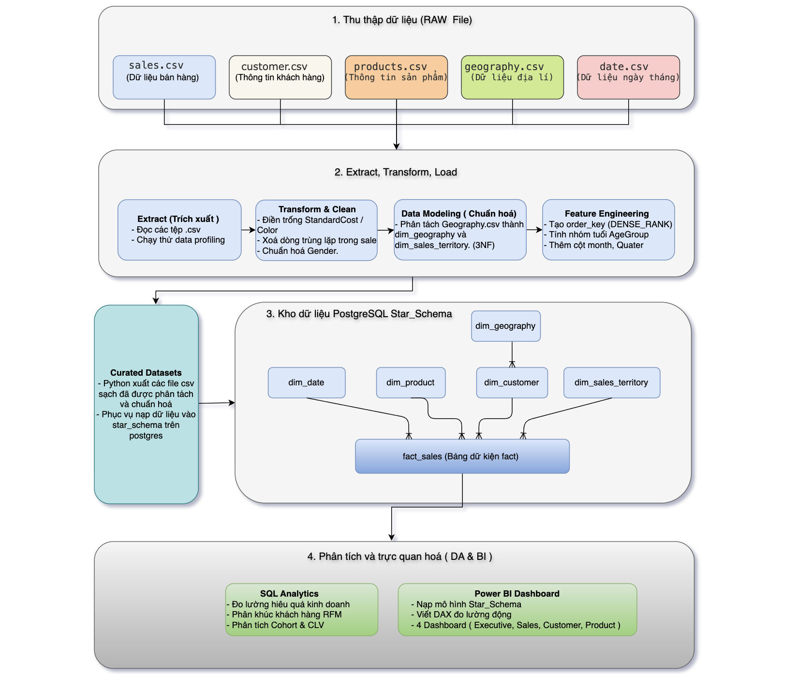
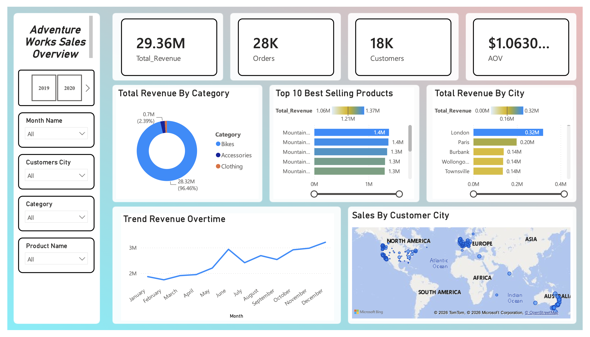
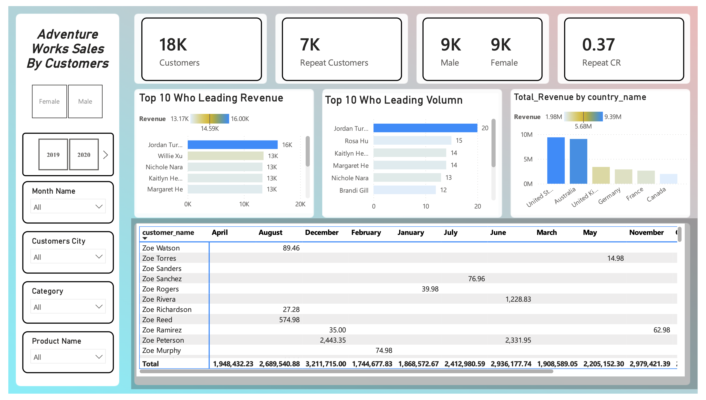
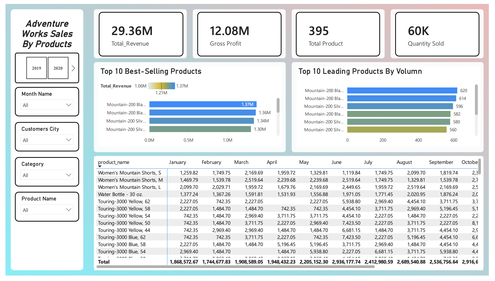

 # Project: AdventureWorks Sales Data Warehouse & Business Intelligence


 # 1. Project Overview

 <p align="center">
     
 </p>

 ### Objective

 Build a complete **Data Warehouse** solution from the **AdventureWorks** sales dataset following an **ETL (Extract – Transform – Load)** process. After cleaning and transforming the data, design a **Star Schema** in **PostgreSQL**, use **SQL** for business performance analysis, and visualize results in **Power BI** to support data-driven decision making.

 Key project tasks:

 - Implement an ETL pipeline using Python (Pandas).
 - Design and deploy a Star Schema in PostgreSQL.
 - Perform business analytics using SQL.
 - Build Power BI dashboards to visualize key metrics for revenue, profit, customers, and products.

 ### Tools & Technologies

 <div align="center">
 
 
 
   
   
   
   

 </div>

 ---

 # 2. ETL Pipeline

 ## 2.1 Extract Data

 ### Objective

 Collect raw data from multiple sources into a **Staging** area to prepare for processing.

 ### Data sources

 - customer.csv
 - products.csv
 - sales.csv
 - geography.csv
 - date.csv

 ### Tasks

 - Read data using **Pandas**
 - Perform **Data Profiling**

 ### Data Profiling

 Check for:

 - Record counts
 - Number of attributes
 - Data types
 - NULL values
 - Duplicates
 - Data distributions

 Example:

 ```python
 sales.info()

 sales.describe()

 sales.isnull().sum()

 sales.duplicated().sum()
 ```

 ---

 # 2.2 Transform Data

 ## Objective

 Clean, standardize, and transform data to ensure consistency and reliability before building the Data Warehouse.

 ---

 ## 2.2.1 Data Cleaning

 ### Handling Missing Values

 #### Products

 Some products, such as:

 - HL Road Frame
 - Mountain Frame
 - Touring Frame

 may have missing fields like:

 - StandardCost
 - Color

 ---

 ### Option 1: Fill with zero

 #### When to use

 - Cost values are not available yet.
 - You want to keep the product in the dataset.
 - Missing data rate is very small.
 - Analysis focuses on revenue or quantity only.

 #### Implementation

 ```python
 product['StandardCost'] = product['StandardCost'].fillna(0)
 ```

 #### Advantages

 - Simple.
 - Preserves records.
 - Does not reduce sample size.

 #### Trade-offs

 Profit will be overestimated:

 ```text
 Profit = SalesAmount - 0
 ```

 ---

 ### Option 2: Fill with the average StandardCost of the SubCategory

 #### When to use

 - Products in the same SubCategory have similar costs.
 - You want to retain full records while keeping reasonable estimates for analysis.

 #### Implementation

 ```python
 product['StandardCost'] = (
     product.groupby('SubCategory')['StandardCost']
            .transform(lambda x: x.fillna(x.mean()))
 )
 ```

 #### Advantages

 - Preserves records.
 - More reasonable cost estimates.
 - Profit analysis is closer to reality.

 #### Trade-offs

 - Only an approximation.
 - Not suitable if cost variability within SubCategory is high.

 ---

 ### Option 3: Drop records

 #### When to use

 - Missing data is minimal (<5%).
 - No reasonable basis for imputation.
 - Analysis requires high accuracy.

 #### Implementation

 ```python
 product = product.dropna(subset=['StandardCost'])
 ```

 #### Advantages

 - Avoids injecting assumed values.
 - Ensures calculations use real data.

 #### Trade-offs

 - Reduces data size.
 - May cause selection bias if missingness is not random.

 ---

 ### Remove duplicates

 ```python
 sales.drop_duplicates(inplace=True)
 ```

 ---

 ### String normalization

 Steps:

 - Trim whitespace.
 - Standardize case.

 Example:

 ```python
 customer['Gender'] = customer['Gender'].str.upper()
 ```

 ---

 ## 2.2.2 Data Modeling

 ### Normalize Geography table

 #### Purpose

 Normalize geographical data by splitting **geography.csv** into two dimension tables to reduce redundancy and fit the **Star Schema** design.

 #### Implementation

 **dim_geography**

 - GeographyKey
 - City
 - PostalCode
 - CountryName
 - SalesTerritoryKey

 **dim_sales_territory**

 - SalesTerritoryKey
 - SalesTerritoryRegion
 - SalesTerritoryGroup

 #### Benefits

 - Reduces redundancy.
 - Aligns with normalization (3NF) principles.
 - Improves reusability of sales territory information across analyses.

 ---

 ## 2.2.3 Feature Engineering

 ### Create `order_key`

 #### Purpose

 The grain of the **fact_sales** table is at the **Product Line** level, meaning each row represents a product in an order.

 Since the dataset does not provide a distinct order identifier, create an **order_key** based on:

 ```text
 (customer_key, order_date)
 ```

 #### Business Logic

 1. Extract unique `(customer_key, order_date)` pairs.
 2. Sort by `customer_key` and `order_date`.
 3. Assign `order_key` sequentially using `DENSE_RANK()`.
 4. Merge `order_key` back into `fact_sales`.

 #### Benefits

 Enables analyses such as:

 - Number of Orders
 - Average Order Value (AOV)
 - Purchase Frequency
 - Cohort Analysis
 - Customer Lifetime Value (CLV)

 ---

 ## 2.2.4 Export Curated Dataset

 ### Objective

 After cleaning and transformation, export tables to new CSV files to build a **Curated Dataset**.

 This curated data will be the input for loading into the Data Warehouse.

 ### Benefits

 - Separates raw and processed data.
 - Makes ETL results easy to validate before loading.
 - Facilitates reuse across different database systems.
 - Improves maintainability and scalability of the ETL process.

 ---

 # 3. Load Data Warehouse

 ### Objective
 - After cleaning and standardizing the data, load it into PostgreSQL and build a **Data Warehouse** using a **Star Schema** to optimize querying, aggregation, and visualization in Power BI.

 ## 3.1 Star Schema Design

 The model consists of a central Fact table surrounded by Dimension tables.

 ### Fact Table

 ### Fact_Sales

 The fact table stores measures related to sales operations.

 **Measures**

 | Column | Description |
 | --- | --- |
 | order_quantity | Quantity of products sold |
 | product_standard_cost | Product cost at time of sale |
 | sales_amount | Sales revenue |

 **Foreign Keys**

 | Column | References |
 | --- | --- |
 | product_key | Dim_Product |
 | customer_key | Dim_Customer |
 | sales_territory_key | Dim_Sales_Territory |
 | order_date_key | Dim_Date |

 > **Note:** Measures like **Profit**, **Profit Margin**, and **Average Selling Price** should not be stored in the Fact table; compute them dynamically using DAX in Power BI to avoid redundancy and ensure consistency when business logic changes.
 >
 ---
 ### Dimension Tables
 ### Dim_Customer

 Stores descriptive customer attributes for analysis by gender, marital status, and geography.

 | Attribute | Data Type | Description |
 | --- | --- | --- |
 | customer_key | INT | Primary key for the customer table. |
 | customer_name | VARCHAR(50) | Customer full name. |
 | birth_date | DATE | Customer birth date. |
 | gender | VARCHAR(50) | Customer gender (Male/Female). |
 | marital_status | VARCHAR(50) | Marital status (Single/Married). |
 | geography_key | INT | Foreign key referencing `dim_geography`, indicating customer location. |

 > **Feature Engineering**
 >
 > Add an `AgeGroup` attribute derived from `BirthDate` to support age-segment analysis.
 >
 > | Attribute | Data Type | Description |
 > | --- | --- | --- |
 > | age_group | VARCHAR(20) | Customer age group (Youth, Adult, Middle Age, Senior). |
 ### Dim_Product

 Stores product information.
 | Attribute    | Data Type  | Description                         |
 | ------------- | ------------- | ----------------------------- |
 | product_key   | INT           | Primary key for the product table. |
 | product_name  | VARCHAR(50)  | Product name.                 |
 | category      | VARCHAR(50)   | Product category.            |
 | sub_category  | VARCHAR(50)   | Product sub-category.    |
 | standard_cost | DECIMAL(18,2) | Product cost.         |
 | color         | VARCHAR(30)   | Product color.         |
 | model_name    | VARCHAR(100)  | Product model name. |
 | status        | VARCHAR(20)   | Product status.      |

 ### Dim_Geography

 Stores geographic information.

 | Attribute          | Data Type | Description                                                 |
 | ------------------- | ------------ | ----------------------------------------------------- |
 | geography_key       | INT          | Primary key for the geography table.                           |
 | city                | VARCHAR(50) | Customer city.                             |
 | country_name        | VARCHAR(50) | Country.                                             |
 | postal_code         | VARCHAR(50)  | Postal code.                                         |
 | sales_territory_key | INT          | Foreign key referencing `dim_sales_territory`. |

 ### Dim_Sales_Territory

 Separate sales territory information to reduce geographic redundancy.
 | Attribute             | Data Type | Description                                |
 | ---------------------- | ------------ | ------------------------------------ |
 | sales_territory_key    | INT          | Primary key for the sales territory table. |
 | sales_territory_region | VARCHAR(50) | Sales territory region.                  |
 | sales_territory_group  | VARCHAR(50) | Sales territory group.                |

 ### Dim_Date

 Stores time attributes to support analysis and drill-down.
 | Attribute | Data Type | Description                                       |
 | ---------- | ------------ | ------------------------------------------- |
 | date_key   | INT          | Primary key for the date table.              |
 | date       | DATE         | Full date.                                |
 | day_name   | VARCHAR(20)  | Day of the week name.                        |
| month      | INT          | Tháng (1–12), dùng để sắp xếp `month_name`. |
| month_name | VARCHAR(20)  | Tên tháng.                                  |
| quarter    | INT          | Quý trong năm (1–4).                        |
| year       | INT          | Năm.                                        |

> **Feature Engineering**
>
>- `Month`: Values from 1–12, used to ensure correct month ordering in Power BI.
>- `Quarter`: For quarterly revenue analysis and to support Drill Down on dashboards.

---

## 3.2 Data Constraints

After creating the tables in the Data Warehouse, define **Primary Keys** and **Foreign Keys** to ensure data integrity and consistency.

### Primary Key

Each Dimension table uses a single-column **Primary Key** to uniquely identify records. The Fact table uses a composite primary key composed of the foreign keys to the Dimension tables.

**Primary keys should be defined as follows:**

| Table | Primary Key |
| --- | --- |
| `dim_product` | `product_key` |
| `dim_customer` | `customer_key` |
| `dim_geography` | `geography_key` |
| `dim_sales_territory` | `sales_territory_key` |
| `dim_date` | `date_key` |
| `fact_sales` | (`product_key`, `customer_key`, `geography_key`, `sales_territory_key`, `order_date_key`) |

Example:

```
ALTER TABLE dim_customer
ADD CONSTRAINT pk_dim_customer
PRIMARY KEY (customer_key);
```

---

### Foreign Key

The `fact_sales` table should include **Foreign Keys** referencing each Dimension table so that every sales record points to the corresponding descriptive data.

**Foreign keys mapping:**

| Fact Column | References |
| --- | --- |
| `product_key` | `dim_product(product_key)` |
| `customer_key` | `dim_customer(customer_key)` |
| `geography_key` | `dim_geography(geography_key)` |
| `sales_territory_key` | `dim_sales_territory(sales_territory_key)` |
| `order_date_key` | `dim_date(date_key)` |

Example:

```
ALTER TABLE fact_sales
ADD CONSTRAINT fk_fact_product
FOREIGN KEY (product_key)
REFERENCES dim_product(product_key);
```

After applying constraints, the Star Schema ensures:

- Every Fact record references valid Dimension records.
- Prevents insertion of invalid or inconsistent data across tables.
- Supports reliable query performance and analysis on the Data Warehouse.

## 3.3 Query Optimization

To improve query and visualization performance, create indexes on the Fact table's foreign keys.

Example:

```
CREATE INDEX idx_fact_sales_product
ON fact_sales(product_key);

CREATE INDEX idx_fact_sales_customer
ON fact_sales(customer_key);

CREATE INDEX idx_fact_sales_date
ON fact_sales(order_date_key);
```

> **Note:** Although the AdventureWorks dataset used in this project is not large, indexes are created on `fact_sales` foreign keys to simulate best practices in production Data Warehouses where Fact tables may contain millions of rows.

---


# 4. SQL Analytics

[- View Data Analysis Using SQL Structure](./sql/Business-Questions.sql)

[- View Insight](./docs/Insight.md)

---

# 5. Power BI Dashboard

Includes:

- Sales Overview Dashboard
<p align="center">
     
</p>

- Customer Dashboard
<p align="center">
     
 </p>

- Product Dashboard
<p align="center">
     
 </p>
